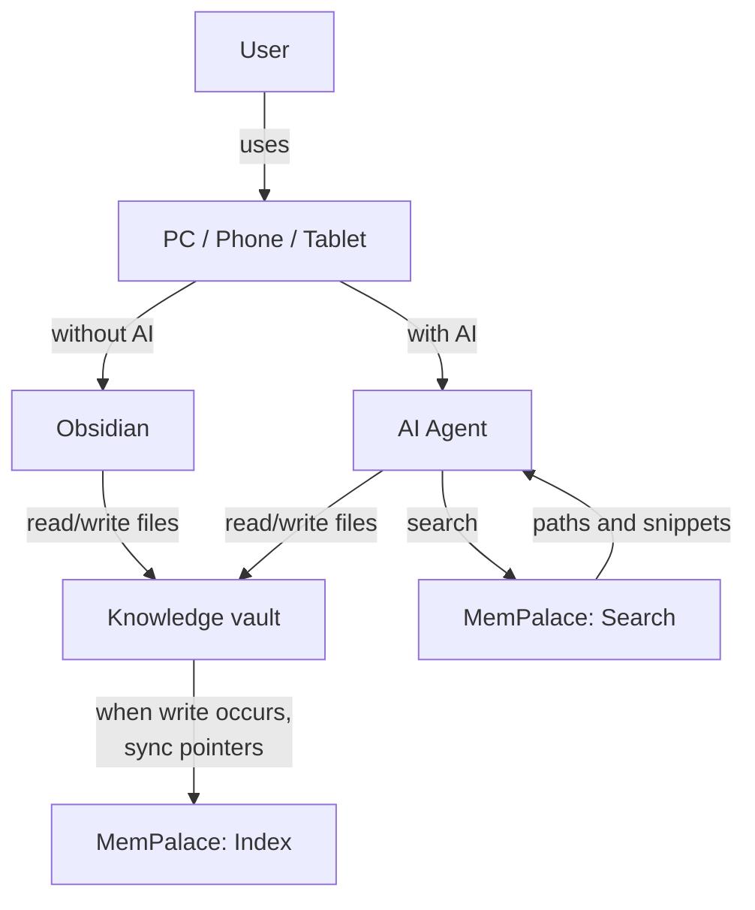
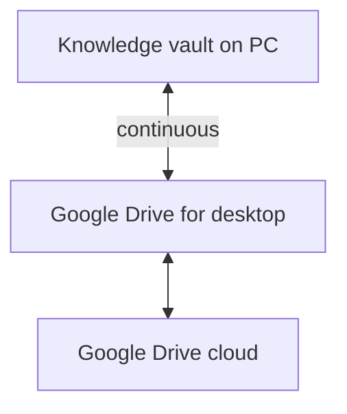
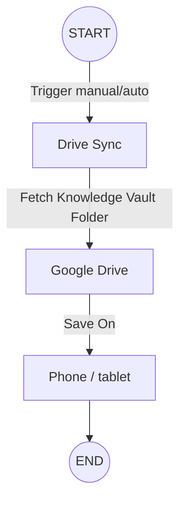
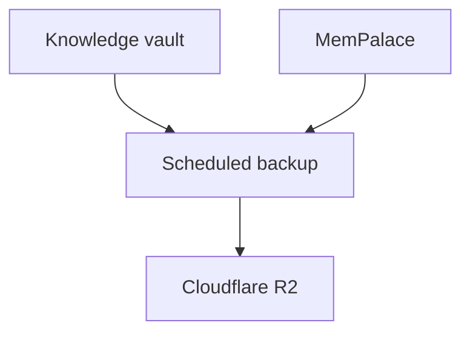

# bamboo-slip

Chinese 简牍: the bamboo slip **is** the original record. Notes point back to it. They do not replace it.

Starter kit from the JB Agentic Meetup talk *The Context You Already Earned*: turning personal knowledge into active AI context at the moment of need.

This is an empty vault plus two skills. It is not anyone's personal notes.

**Monday habit (no install):** before you ask an AI to help with a task, give it one source you already trust on that topic, and require the answer to point back to it.

## What this is

Years of notes, articles, transcripts, and decisions do not help a new chat unless you put them in. This kit is the smallest layout that makes that repeatable:

- `raw/` — verbatim sources, grouped by **media type**
- `wiki/` — compiled, cited notes (Karpathy's "compile a wiki")
- MemPalace — **search index**, required, run by you after writes
- Obsidian — for humans to read **and** write the markdown

Tags are for subject. Folders are for media type.

## Layout

```
raw/articles/
raw/books/
raw/videos/      # store captions (.vtt / .srt). Keep bulky media out of git.
raw/podcasts/    # same: captions, not the audio, unless you choose to.
raw/images/
raw/posts/
raw/notes/       # free-style. Zettelkasten (Luhmann, slip box) is one style, not the rule.
raw/diaries/     # often private; gitignored except the empty folder
wiki/
skills/compile-wiki/
skills/index-vault/
scripts/index_vault.py
```

For videos and podcasts in another language (for example Chinese): transcribe with Whisper, keep the **original** captions and a translation.

## Skills

Only two. Copy `skills/compile-wiki` and `skills/index-vault` into your agent host if it does not load `skills/` from the repo.

| Skill | Job |
|---|---|
| **compile-wiki** | Turn new `raw/` material into a cited `wiki/` note. Karpathy's verb. |
| **index-vault** | After **any** vault write, update MemPalace pointers. Not only after compile. |

Supported CLI agents: **Claude Code**, **Codex**, **OpenCode**.

## MemPalace is required, and it does not auto-index

Search goes through MemPalace. The agent gets title, path, tags, and a short snippet, then reads the `.md`.

Indexing is **not** stock MemPalace behaviour:

- You run `index-vault` / `python scripts/index_vault.py ...`
- There is **no file watch**
- `mempalace sync` **prunes** missing sources. It is not ingest
- Other ingest paths exist in MemPalace (`mine`, MCP drawers). This kit uses the pointer script above

```bash
python scripts/index_vault.py --vault . --palace "<PALACE_PATH>" --sync
```

Pass `--palace` **exactly** as the MemPalace server uses it.

## How the pieces talk

Caveat: `when write occurs` means **you** run `index-vault`. MemPalace does not watch files.



## Where to keep the files

The live vault is markdown on disk (or a synced folder). MemPalace is local, on the machine running the agent. Object storage is backup, not the live store.

| Option | Role |
|---|---|
| Google Drive (desktop app) | Live vault sync to a PC |
| Self-hosted / NAS | Live vault if you already run one |
| VPS | Live vault if the agent runs there |
| [Obsidian Sync](https://obsidian.md/sync) | Live vault. About **$4/mo yearly** or **$5/mo monthly** |
| GitHub / GitLab / Bitbucket | Fine for a public or private markdown repo |
| Cloudflare R2 (or similar) | **Backup** of vault + MemPalace, not the working copy |

Obsidian Sync vs Drive: if an agent writes while Obsidian is closed, the phone can lag until a sync runs. That is the tradeoff. Sync is not a MemPalace replacement.

### Example: Drive on a PC



### Example: phone / tablet via DriveSync

Manual or scheduled pull of the **knowledge vault folder** onto the device. The agent still runs on a machine that can see the vault and MemPalace.



### Backup



## Honest limits

- A cited wiki note is not automatically true
- Retrieval can miss
- Diaries often should not be public; this repo gitignores `raw/diaries/*`
- Do not paste private notes into a public fork

## Credits

- [Andrej Karpathy](https://x.com/karpathy), [LLM Knowledge Bases](https://x.com/i/status/2039805659525644595) (2 Apr 2026) — ingest into `raw/`, compile a wiki, ask questions against it. `compile-wiki` is his verb. This kit still uses a search index; his small-corpus “no vector store” claim does not apply wholesale.
- [Tiago Forte](https://www.buildingasecondbrain.com/), *Building a Second Brain* — the problem that notes do not help until they show up at the point of work. This kit does not teach his folders or workflow.

## License

[CC BY-NC-SA 4.0](https://creativecommons.org/licenses/by-nc-sa/4.0/). Copy and adapt with credit. Do not sell it. See `LICENSE`.
