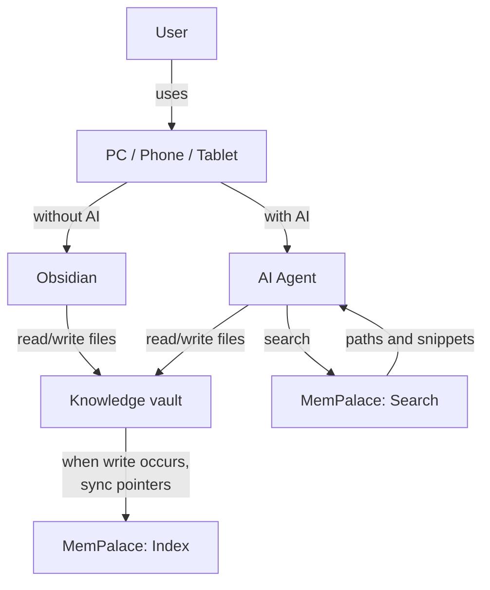
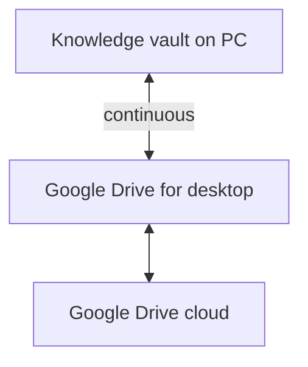
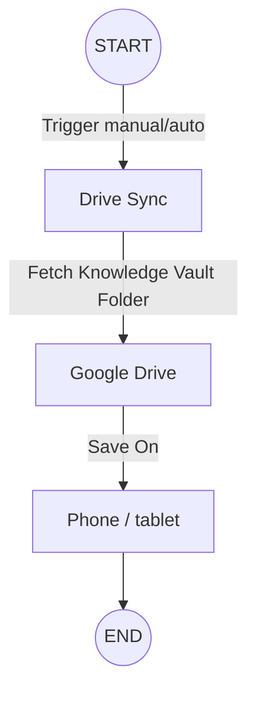
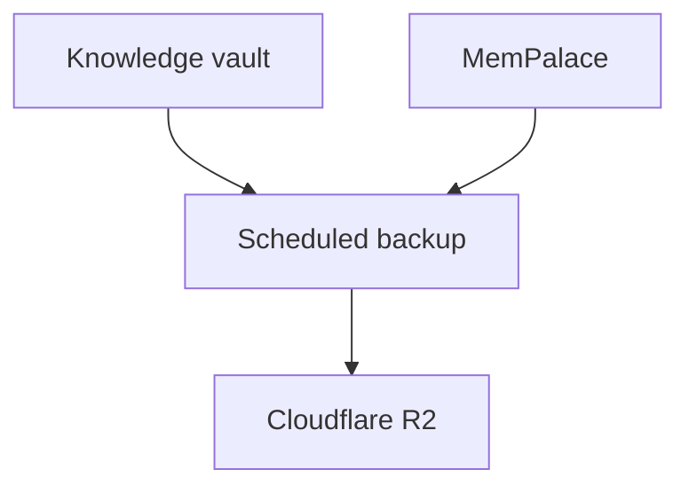

# jiandu

*Jiandu* (简牍 / 簡牘), often translated into English as “bamboo slips,” refers to historical writing slips made from bamboo or wood. The project name reflects the idea that the original source is the record: compiled notes point back to it rather than replacing it.

Starter kit from the JB Agentic Meetup talk *The Context You Already Earned*: turning personal knowledge into active AI context at the moment of need.

This is an empty vault plus two skills. It is not anyone's personal notes.

**First step:** before you ask an AI to help with a task, give it one source you already trust on that topic, and require the answer to point back to it. Try this with the AI you already use: attach the source, paste a relevant excerpt, or give it a URL it can read. `jiandu` is optional setup for a durable vault.

## What this is

Years of notes, articles, transcripts, and decisions do not help a new chat unless you put them in. This kit is the smallest layout that makes that repeatable:

- `raw/` — verbatim sources, grouped into convenient source folders
- `wiki/` — compiled, cited notes (Karpathy's "compile a wiki")
- MemPalace — **search index**, required, run by you after writes
- Obsidian — for humans to read **and** write the markdown

Folders help decide where to put a source; tags describe its subject and cross-cutting topics. Not every folder is a media type.

## Layout

```
raw/articles/    # saved articles and long-form web writing
raw/books/       # book excerpts and reading notes
raw/courses/     # source materials from a course, such as handouts or transcripts
raw/newsletter/  # newsletter issues kept as received
raw/videos/      # video captions or transcripts (.vtt / .srt); not bulky video files
raw/podcasts/    # podcast captions or transcripts; not audio files by default
raw/images/      # images and related original source material
raw/posts/       # social-media or forum posts
raw/notes/       # original personal notes; Zettelkasten is one optional style
raw/diaries/     # personal diary entries; often private and gitignored by default
wiki/
skills/compile-wiki/
skills/index-vault/
scripts/index_vault.py
```

Use tags to identify subjects across folders. For example, movie captions go in `raw/videos/` with a `movie` tag; course source materials go in `raw/courses/`, while an AI-compiled synthesis belongs in `wiki/`.

For videos and podcasts in another language (for example Chinese): transcribe with Whisper, keep the **original** captions and a translation.

The indexer creates MemPalace pointers for Markdown, VTT, and SRT files. Image or audio/video files are not themselves indexed as pointers; keep bulky media out of Git and store it separately if needed. Add a Markdown description or transcript under the relevant `raw/` folder when you want searchable text linked to media.

## Skills

The canonical copies of the two skills live in `skills/`. Ask your AI agent to copy them into the location expected by your harness. Edit the canonical files here; the agent can copy them again when you want to update its installed skills.

| Skill | Job |
|---|---|
| **compile-wiki** | Turn new `raw/` material into a cited `wiki/` note. Karpathy's verb. |
| **index-vault** | After **any** vault write, update MemPalace pointers. Not only after compile. |

Supported CLI agents: **Claude Code**, **Codex**, **OpenCode**.

## MemPalace is required, and it does not auto-index

Search goes through MemPalace. The agent gets title, path, tags, and a short snippet, then reads the `.md`.

Indexing is **not** stock MemPalace behaviour:

- You run `index-vault` / `python scripts/index_vault.py ...`
- There is **no file watch**
- `mempalace sync` **prunes** missing sources. It is not ingest
- Other ingest paths exist in MemPalace (`mine`, MCP drawers). This kit uses the pointer script above

```bash
python scripts/index_vault.py --vault . --palace "<PALACE_PATH>" --sync
```

Pass `--palace` **exactly** as the MemPalace server uses it.

### First-run setup

1. Install MemPalace and configure its MCP server in the agent host you use. Follow the [MemPalace installation guide](https://github.com/MemPalace/mempalace).
2. Ask your agent to install the skills from `skills/` using your harness's usual project-skill setup.
3. Find the exact MemPalace path used by the server and pass it to `--palace`.
4. Add a source under `raw/`, compile a cited note under `wiki/`, then run the indexing command above after the write.

The indexer supports Markdown plus `.vtt` and `.srt` caption files. It stores a short searchable excerpt and a relative path; originals remain in the vault. A complete scan is required before it changes pointers. Use the same stable vault location when indexing: its path identifies its pointers, and a move creates a new identity rather than automatically deleting the old one.

## How the pieces talk

Caveat: `when write occurs` means **you** run `index-vault`. MemPalace does not watch files.



## Where to keep the files

The live vault is markdown on disk (or a synced folder). MemPalace is local, on the machine running the agent. Object storage is backup, not the live store.

| Option | Role |
|---|---|
| Google Drive (desktop app) | Live vault sync to a PC |
| Self-hosted / NAS | Live vault if you already run one |
| VPS | Live vault if the agent runs there |
| [Obsidian Sync](https://obsidian.md/sync) | Live vault. About **$4/mo yearly** or **$5/mo monthly** |
| GitHub / GitLab / Bitbucket | Fine for a public or private markdown repo |
| Cloudflare R2 (or similar) | **Backup** of vault + MemPalace, not the working copy |

Obsidian Sync vs Drive: if an agent writes while Obsidian is closed, the phone can lag until a sync runs. That is the tradeoff. Sync is not a MemPalace replacement.

### Example: Drive on a PC



### Example: phone / tablet via DriveSync

Manual or scheduled pull of the **knowledge vault folder** onto the device. The agent still runs on a machine that can see the vault and MemPalace.



### Backup



## Honest limits

- A cited wiki note is not automatically true
- Retrieval can miss
- Diaries often should not be public; this repo gitignores `raw/diaries/*`. A compiled `wiki/` note or its MemPalace excerpt can still reveal private material, so review the destination before compiling or indexing private sources.
- Do not paste private notes into a public fork

## Credits

Influences:

- [Andrej Karpathy](https://x.com/karpathy), [LLM Knowledge Bases](https://x.com/i/status/2039805659525644595) (2 Apr 2026) — ingest into `raw/`, compile a wiki, ask questions against it. `compile-wiki` is his verb. This kit also uses a search index for durable vaults and cross-session lookup; his post describes index files and a small search engine, and its claim is scoped to a small corpus.
- [Tiago Forte](https://www.buildingasecondbrain.com/), *Building a Second Brain* — the problem that notes do not help until they show up at the point of work. This kit does not teach his folders or workflow.
- [Niklas Luhmann](https://en.wikipedia.org/wiki/Zettelkasten) / Zettelkasten (slip box) — one optional style for `raw/notes`. Not required, and not a folder in this kit.

Tools (not this repo):

- [MemPalace](https://github.com/MemPalace/mempalace) — required search index. `scripts/index_vault.py` writes pointers into it; it does not replace MemPalace, and MemPalace does not auto-index.
- [Obsidian](https://obsidian.md) — human editor for the markdown. Optional. The files are plain `.md`.

## License

[CC BY-NC-SA 4.0](https://creativecommons.org/licenses/by-nc-sa/4.0/). Copy and adapt with credit. Do not sell it. See `LICENSE`.
