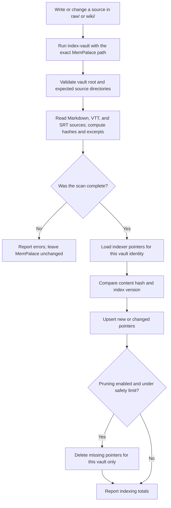

# System flow

After any write under `raw/` or `wiki/`, the user runs `index-vault`. The script reads the full source set before touching MemPalace. A scan failure stops the run without changing pointers. A successful scan refreshes changed pointers and prunes missing pointers only within the same vault identity.

